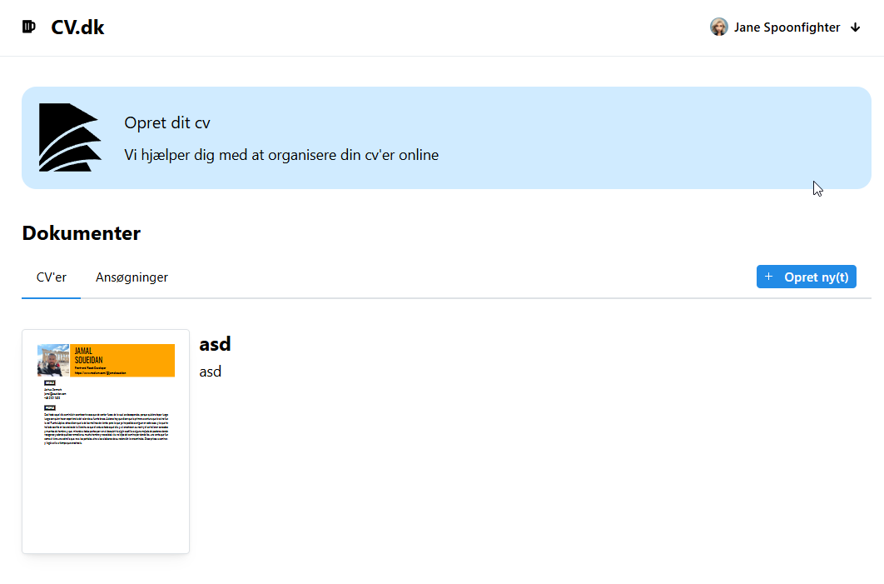

# CV Editor - Built with Remix and React-PDF



This is a browser-based CV Editor powered by [Remix](https://remix.run/) and [react-pdf](https://react-pdf.dev/), enabling users to create, edit, and export CVs in PDF format.

## Getting Started

This project uses Remix for seamless development and deployment, with React-PDF for rendering CVs as PDF documents directly in the browser.

### Prerequisites

Ensure you have [Node.js](https://nodejs.org/) and [npm](https://www.npmjs.com/) installed.

## Development

Run the dev server:

```bash
npm run dev
```
