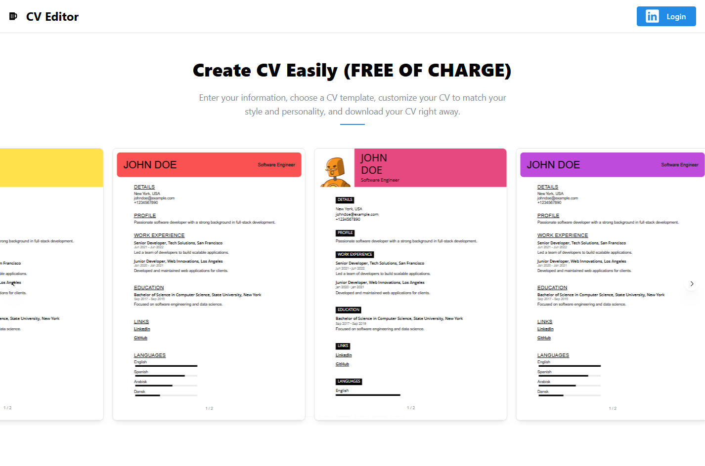
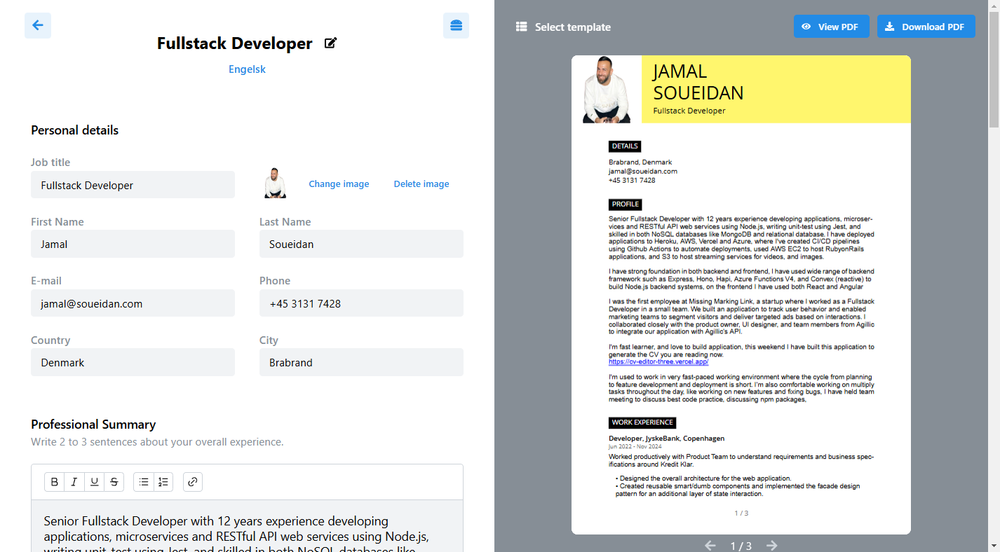

# CV Editor - Built with React Router V7 and React-PDF




This is a browser-based CV Editor, enabling users to create, edit, and export CVs in PDF format.

I've moved the code to the new React Router V7, made some improvements to the PDF Reader, so it use context.

Replace:
@hello-pangea/dnd, > motion (support react 19)
photoEditor > uppy

## Getting Started

This project uses React Router v7, with React-PDF for rendering CVs as PDF documents directly in the browser.

### Prerequisites

Ensure you have [Node.js](https://nodejs.org/) and [npm](https://www.npmjs.com/) installed.

## Development

Run the dev server:

```bash
npm run dev
```

## AI Images

1. Ask chat.com about explain a image
   https://chatgpt.com/

2. Use DeepAI to create image (remember to enchance the image for free)
   https://deepai.org/machine-learning-model/kawaii-emoji-generator

3. Uncrop Image to (extend the image wider)
   https://www.pixelcut.ai/t/uncrop
